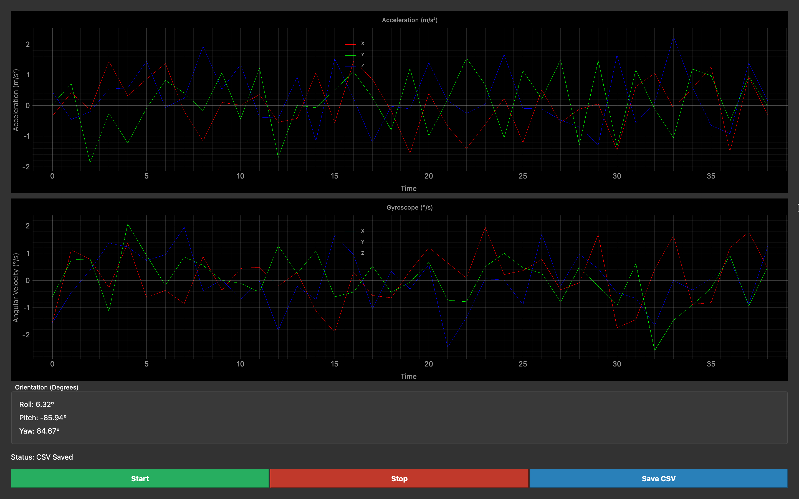

#  IMU Dashboard (PyQt)

##  Overview

This project is a **real-time IMU (Inertial Measurement Unit) dashboard** built using PyQt.
It visualizes sensor data including **acceleration, gyroscope, and orientation** in an interactive UI.

The system simulates IMU data and displays it in real-time with smooth plotting and telemetry logging.

---

##  Features

* Real-time plotting using pyqtgraph
* Acceleration visualization (X, Y, Z)
* Gyroscope visualization (X, Y, Z)
* Orientation display (Roll, Pitch, Yaw)
* Start / Stop controls
* CSV logging for telemetry data
* Clean and intuitive UI

---

## 🛠️ Tech Stack

* Python
* PyQt5
* pyqtgraph
* NumPy

---

## ▶️ How to Run

### 1. Install Dependencies

```bash
pip install pyqt5 pyqtgraph numpy
```

### 2. Run Application

```bash
python main.py
```

---

## 📁 Project Structure

```text
imu-dashboard-pyqt/
│
├── main.py
├── dashboard.py
├── simulator.py
├── dashboard.png
├── imu_data.csv
├── README.md
```

---

##  Output



---

##  CSV Logging

The dashboard logs IMU data into a CSV file (`imu_data.csv`) for **post-analysis and debugging**.

---

##  Future Improvements

* Integration with real IMU hardware (UART/Serial)
* Advanced visualization (3D orientation indicator)
* Alert system for abnormal values

---

##  Key Concepts Demonstrated

* Real-time data visualization
* Event-driven programming using QTimer
* GUI development with PyQt
* Data logging and telemetry systems

---

##  Author

**Raj Kisley**

---
